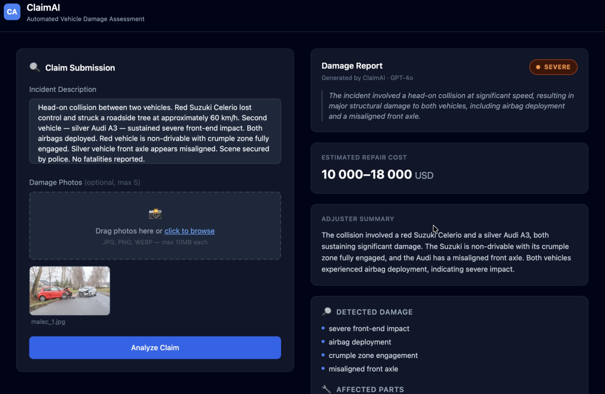

# ClaimAI — Vehicle Damage Analyzer

> Describe the accident. Upload the photos. Get a structured damage report in seconds.

ClaimAI automates vehicle damage assessment for insurance adjusters. Instead of manually reviewing photos, writing up damage descriptions and estimating repair costs — which takes 45–90 minutes per claim — ClaimAI does it in under 10 seconds using a YOLO + GPT-4o pipeline.



---

## How It Works

The user submits an incident description and up to 5 damage photos. The backend runs them through two AI systems in parallel:

1. **Roboflow YOLO** — detects damaged parts in each photo (dents, broken glass, crumple zones, etc.) and returns bounding boxes with confidence scores
2. **GPT-4o** — receives both the YOLO detections and the written description, then streams back a structured JSON report

The report streams live to the UI token-by-token via **Server-Sent Events** — no waiting for the full response before anything appears.

```
Photos + Description
        │
        ├──► Roboflow YOLO (parallel, one request per image)
        │         └── [{ class, confidence, x, y, width, height }, ...]
        │
        ▼
GPT-4o  ←  YOLO detections + incident text
  model: gpt-4o
  response_format: json_object   ← guarantees parseable output
  stream: true
        │
        ▼
SSE stream → frontend assembles JSON live → report renders
```

---

## Demo


## Features

- **Drag & drop photo upload** — up to 5 images, 10MB each
- **Parallel YOLO inference** — all photos analyzed simultaneously via `Promise.all()`
- **Live streaming report** — GPT-4o output appears token-by-token as it generates
- **Severity classification** — MINOR / MODERATE / SEVERE / TOTAL LOSS with reasoning
- **Structured output** — damage list, affected parts, cost range, adjuster summary, recommended actions
- **Works without photos** — text-only analysis also supported

---

## Stack

| | |
|---|---|
| **Frontend** | React 18, Vite, Tailwind CSS |
| **Backend** | Node.js, Express |
| **Vision AI** | Roboflow Hosted Inference (YOLO) |
| **Language AI** | OpenAI GPT-4o with streaming |
| **Transport** | Server-Sent Events (SSE) |
| **Deploy** | Railway |

---

## Running Locally

**Prerequisites:** Node.js 18+, OpenAI API key with billing, Roboflow API key + model ID

```bash
git clone https://github.com/yourusername/claimai.git
cd claimai

# Install
cd backend && npm install
cd ../frontend && npm install

# Configure
cp .env.example backend/.env
# → fill in OPENAI_API_KEY, ROBOFLOW_API_KEY, ROBOFLOW_MODEL_ID

# Run
cd backend && npm run dev      # :3001
cd ../frontend && npm run dev  # :5173
```

Open `http://localhost:5173`.

**Finding a Roboflow model:** [universe.roboflow.com](https://universe.roboflow.com/search?q=car+damage+detection) → pick any car damage model → Deploy → Hosted API → copy the model ID (format: `model-name/1`).

---

## Key Technical Decisions

**SSE over WebSockets** — LLM streaming is server→client only. SSE works over standard HTTP, requires no upgrade handshake, and is natively supported by `response.body.getReader()` in modern browsers.

**`response_format: json_object`** — Forces GPT-4o to return valid JSON every time. Without this, the model occasionally wraps output in markdown code fences which breaks `JSON.parse()`.

**`multer.memoryStorage()`** — Files stay in RAM as `Buffer` objects. No disk writes, works correctly on Railway and other stateless/ephemeral platforms.

**`Promise.all()` for YOLO** — All uploaded images are sent to Roboflow in parallel. For 5 images this means ~1s total instead of ~5s sequential.
